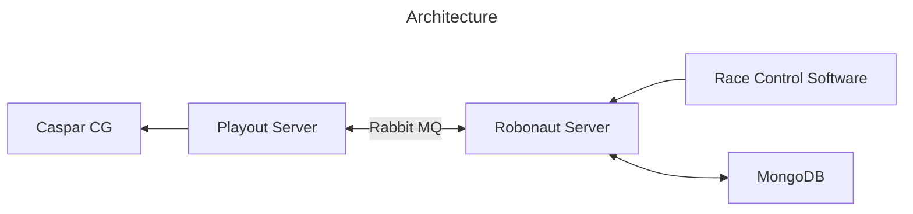

# RobonAUT Server

[](https://github.com/BSStudio/robonaut-server/actions/workflows/docker.yml)
[](https://github.com/BSStudio/robonaut-server/actions/workflows/gradle.yml)
[](https://github.com/BSStudio/robonaut-server/actions/workflows/integration.yml)
[](https://github.com/BSStudio/robonaut-server/actions/workflows/release.yml)


[](https://sonarcloud.io/dashboard?id=BSStudio_robonaut-server)
[](https://sonarcloud.io/dashboard?id=BSStudio_robonaut-server)
[](https://sonarcloud.io/dashboard?id=BSStudio_robonaut-server)
[](https://sonarcloud.io/dashboard?id=BSStudio_robonaut-server)
[](https://sonarcloud.io/dashboard?id=BSStudio_robonaut-server)
[](https://sonarcloud.io/dashboard?id=BSStudio_robonaut-server)
[](https://sonarcloud.io/dashboard?id=BSStudio_robonaut-server)
[](https://sonarcloud.io/dashboard?id=BSStudio_robonaut-server)
[](https://sonarcloud.io/dashboard?id=BSStudio_robonaut-server)
[](https://sonarcloud.io/dashboard?id=BSStudio_robonaut-server)


***
[RobonAUT](http://robonaut.aut.bme.hu/) is an annual robot competition organized by the Faculty of Electrical Engineering and Informatics of Budapest University of Technology and Economics, dating back more than a decade.
The event is livestreamed by BSS, one of the university student-operated video studios.
During the live broadcast, we wanted to show live data to our viewers.
The organizers followed the events of the races in their own software.
To display the events, we created software that uses [CasparCG](https://casparcg.com/) to display the data on the stream.

This program persisted the events of the tournament and broadcasted the details of the events to the playout software.



## Run the application
### Using docker compose
```shell
docker compose up -d
```

### Using gradle
```shell
./gradlew bootRun
```

## Dependencies
The project using **MongoDB** as its persistent storage.  
For message broadcasting **RabbitMQ** is used.

## Environment variables
The required environment variables can be found here:  
`application/src/main/resources/META-INF/additional-spring-configuration-metadata.json`  
For MongoDB and RabbitMQ specific variables visit Spring Boot documentations.

## Documentation

To access the documentation run the application and navigate to `http://localhost:8080/`.
